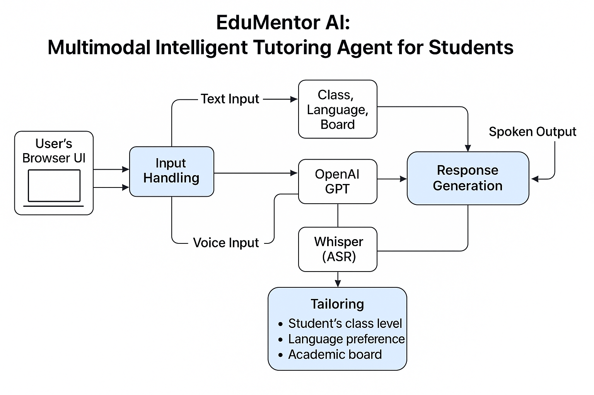

# EduMentor AI - Multimodal Student Tutoring System

A comprehensive AI-powered tutoring application that supports students from Class 1 to Postgraduate level through text, image, and voice interactions.

---

## 🚀 Features

- **Multimodal Input Support**: Text ✅, Image (OCR) ✅, Voice recognition ✅
- **Adaptive Learning**: Responses tailored to student's class level and academic board ✅
- **Language Support**: English, Hindi, and mixed language options (Romanized) ✅
- **Indian Education System**: Supports CBSE, ICSE, SSC, IB, IGCSE boards ✅
- **Real-time Chat Interface**: Interactive conversation history ✅
- **Session Management**: Persistent student profiles (in-memory) ✅
- **Responsive Design**: Works on desktop and mobile devices ✅

---

## 📍 Roadmap

### ✅ Completed

- [x] Flask-based backend setup
- [x] OpenAI GPT-3.5-turbo integration
- [x] Text query support via JSON API
- [x] Image OCR support (via pytesseract)
- [x] Voice query support (via `SpeechRecognition`)
- [x] Multilingual (desi-style, Romanized) responses
- [x] Dynamic UI in `index.html` + `script.js`
- [x] Demo mode (fallback when no API key)
- [x] Student session management
- [x] System prompt aligned with Indian education

### 🔧 In Progress / To Do

- [ ] Replace in-memory sessions with persistent DB (SQLite/PostgreSQL)
- [ ] Improve error feedback in UI (image quality, mic access)
- [ ] Add text-to-speech response (TTS) via Web Speech API or external service
- [ ] Generate follow-up questions or flashcards automatically
- [ ] Save conversation history per session
- [ ] Add diagram/handwriting recognition for STEM questions
- [ ] Parent/Teacher feedback dashboard
- [ ] Mobile PWA optimization
- [ ] Docker + CI/CD setup
- [ ] Model upgrade to GPT-4 (optionally via toggle)
- [ ] Load balancing and scaling for production
- [ ] Azure/AWS/GCP deployment-ready setup

---

## 📁 Project Structure

```
edumentor-ai/
├── main.py              # Flask backend server
├── templates/           # HTML templates directory
│   └── index.html      # Main frontend interface
├── static/             # Static files directory
│   └── script.js       # Frontend JavaScript
├── requirements.txt    # Python dependencies
└── README.md           # This file
```

---

## 🛠️ Installation & Setup

### Prerequisites

1. **Python 3.7+**
2. **Tesseract OCR**
3. **Microphone access** (for voice input)

### Step 1: Install Tesseract OCR

**Windows**:  
Download from: https://github.com/UB-Mannheim/tesseract/wiki  
Add to PATH.  
Verify with:
```bash
tesseract --version
```

**macOS/Linux**:
```bash
brew install tesseract
# or
sudo apt install tesseract-ocr
```

### Step 2: Clone and Setup Project

```bash
git clone https://github.com/yourusername/edumentor-ai.git
cd edumentor-ai

mkdir templates static
# Move your files into place:
# main.py → .
# index.html → templates/
# script.js → static/
```

### Step 3: Install Python Dependencies

```bash
python -m venv venv
source venv/bin/activate  # or venv\Scripts\activate on Windows
pip install -r requirements.txt
```

### Step 4: Create requirements.txt

```txt
Flask==2.3.3
Flask-CORS==4.0.0
Pillow==10.0.1
pytesseract==0.3.10
SpeechRecognition==3.10.0
openai==1.3.5
python-multipart==0.0.6
python-dotenv==1.0.0
```

---

## 🚀 Running the Application

```bash
python main.py
```

Visit: [http://localhost:5000](http://localhost:5000)

---

## 🔧 Configuration

### OpenAI Integration

1. Create `.env` file in project root:

```env
OPENAI_API_KEY=your_actual_openai_key_here
```

2. Don't commit `.env` to git (add it to `.gitignore`)

---

## 🎯 Usage Guide

### 1. Student Registration

- Name (optional)
- Class level
- Academic board
- Language preference
- Save profile

### 2. Ask Questions

#### Text Input:
Type question → click **Ask**

#### Image Input:
Upload image → click **Analyze Image**

#### Voice Input:
Click mic → speak → click stop

---

## 🔍 Troubleshooting

| Issue | Solution |
|-------|----------|
| `TemplateNotFound` | Ensure `index.html` is in `templates/` |
| Mic not working | Allow microphone in browser |
| OCR not working | Install Tesseract and check PATH |
| OpenAI API Error | Check your API key and rate limits |

---

## 🧠 Architecture



---

## 📊 Performance Optimization

- Use Gunicorn for production:  
  `gunicorn -w 4 -b 0.0.0.0:5000 main:app`

- For Docker setup:
```dockerfile
FROM python:3.11-slim
RUN apt update && apt install -y tesseract-ocr
WORKDIR /app
COPY requirements.txt .
RUN pip install -r requirements.txt
COPY . .
EXPOSE 5000
CMD ["gunicorn", "-w", "4", "-b", "0.0.0.0:5000", "main:app"]
```

---

## 🛡️ Security Considerations

- API key not in code
- Input sanitization (esp. OCR, file uploads)
- Rate limiting (future enhancement)
- HTTPS in production

---

## 🤝 Contributing

1. Fork project
2. Create feature branch
3. Add code/tests
4. Pull request

---

## 📄 License

MIT License — see `LICENSE` file

---

## 📞 Support

- Raise an issue on GitHub
- Use Discussions tab